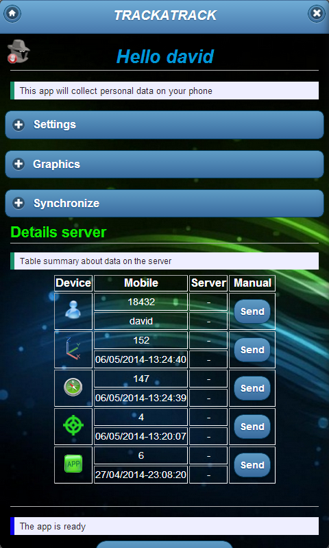

# TrackAtrack
This project proposes a possible solution to the problem of automating data collection for the analysis and study of behaviors, limitations and characteristics of real users of the process. The development of a mobile application that is able to monitor the user's actions in their daily life under their approval. All the data can be consulted from the mobile device by means of information visualization techniques and will also be sent to a common database through a server for a much simpler collection and study of the data.

## Technologies
Proyect is created with:
* Android Studio
* HTML5, CSS3 y Javascript
  * Jquery Mobile
  * Gmaps.js
* Phonegap
  * Cordova
* MySQL
* PHP
* Android 2.4

## Application

<table>
  <tr>
    <td></td>
    <td></td>
    <td></td>
  </tr>
  <tr>
    <td></td>
    <td></td>
    <td></td>
  </tr>
 </table>